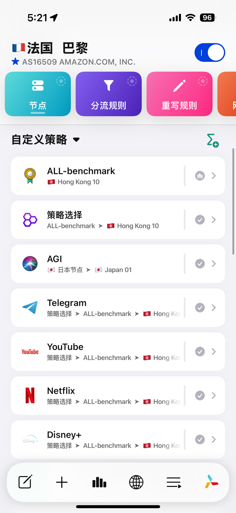

## Preview

# Quantumult-X-
自用conf配置文件，基本已经完善了国内外分流、去广告和解锁功能，由于对于去广告的强迫症思维，该配置在去广告的功能上集成度很高。
规则80%来源于其他开源项目，剩下20%为本人完善。在大佬的基础上加入了一些我自己的使用习惯。感谢各位大佬的付出。在此致谢。
个人觉得是相当完善的一个配置，如果发现了有问题会不定时进行更新。

# 具体操作（如何使用QX懒人配置文件）

机场需要自己进行准备，然后去设置里配置MITM证书，具体过程参照 @Shawn 提供的 [Quantumult X 不完全指南](https://www.notion.so/Quantumult-X-1d32ddc6e61c4892ad2ec5ea47f00917#bb2dce7c01114955bbdbbd222f2a5fcf)这里不再赘述。

## 下载预配置文件
> 1. 下载 quantumult.conf 预配置文件链接至设备自带文件管理系统（建议使用Safari进行）
> 2. 进入 QuantumultX ，点击右下角 [三菱按钮/设置按钮]
> 3. 找到 [配置文件] 模块下的 [导入配置] 点击
> 4. 在你的文件夹里找到刚才下载的配置文件(.conf)
> 5. 右上角对勾确认，届时 QuantumultX 将把除了节点和MITM配置证书的全部配置加载出来。

### `🌐 公共 DNS 推荐`（已包含在配置文件里）
    
    - https://doh.pub/dns-query
    - 119.29.29.29 [腾讯DnsPod+]
    - 182.254.116.116
    - 223.5.5.5 [阿里云公共DNS]
    - 223.6.6.6
    - doq-server：quic://dns.alidns.com:853, 
    - quic://223.5.5.5:853, 
    - quic://223.6.6.6:853,
    - quic://dns.adguard.com,
    - quic://a.passcloud.xyz:784
    - IPV6-server:
    - server=[2400:3200::1]
    - server=[2400:3200:baba::1]
    - server=[2402:4e00::]
    - server=[2606:4700:4700::1111]
    - server=[2606:4700:4700::1001]
	
# Qantumult X解析器及作者
年轻人的最后一款资源解析器。
[KOP-XIAO](https://github.com/KOP-XIAO)
resource_parser_url=https://raw.githubusercontent.com/KOP-XIAO/QuantumultX/master/Scripts/resource-parser.js

**说明**
配置文件的分流逻辑是大多数境外网站走Geoip进行分流，境内走直连。分流和重写规则已经能过滤掉大部分常用的软件里的广告。
- GeoIP 规则已经可以解决绝大多数的境内网站直连。
- 而剩下未能被匹配的规则使用 Final 即可。
- 在很多常用的软件上也可以选择国家和地区，固定国家ip的登录对于风控严格的软件账户是非常必要的。
- 在Boxjs上可以自主管理脚本，本配置集成了薯条 [Virgil Clyne](https://github.com/VirgilClyne) 
的iRingo https://github.com/VirgilClyne/iRingo 以及
DualSubs https://github.com/DualSubs
- BoxJs需要自己手动进行配置，具体配置过程参见 [Chavy](https://github.com/chavyleung)
的https://docs.boxjs.app/ 才可以正常使使用。

## *致谢（如有发现有疏漏请立即联系本人）*

* [Semporia](https://github.com/Semporia)
* [scomper](https://github.com/scomper/Surge)
* [zqzess](https://github.com/zqzess)
* [han3013](https://github.com/han3013?tab=repositories)
* [chouchoui](https://github.com/chouchoui)
* [zZPiglet](https://github.com/zZPiglet/Task/tree/master)
* [app2smile](https://github.com/app2smile)
* [smartmimi](https://github.com/smartmimi/conf/tree/master)
* [id77](https://github.com/id77)
* [MuTu](https://github.com/githubdulong/Script)
* [Keywos](https://github.com/Keywos)
* [Yichahucha](https://github.com/yichahucha/surge/tree/master)
* [Hackl0us](https://github.com/Hackl0us)
* [NobyDa](https://github.com/NobyDa)
* [VirgilClyne](https://github.com/VirgilClyne)
* [KOP-XIAO](https://github.com/KOP-XIAO)
* [Peng-YM](https://github.com/Peng-YM)
* [Chavy](https://github.com/chavyleung)
* [nzw9314](https://github.com/nzw9314)
* [Tartarus2014](https://github.com/Tartarus2014)
* [Rabbit-Spec](https://github.com/Rabbit-Spec/Surge)
* [MartinsKing](https://github.com/ClydeTime?tab=repositories)
* [Virgil Clyne](https://github.com/VirgilClyne?tab=repositories)
* [ExaAlice](https://github.com/ExaAlice/Alice)
* [Alexandr Garbuzov](https://github.com/anuraghazra/github-readme-stats/blob/master/docs/readme_cn.md)
* [Orz-3](https://github.com/Orz-3)
* [ConnersHua](https://github.com/DivineEngine/Profiles/tree/master)
* [mieqq](https://github.com/mieqq/mieqq)
* [Yachen Liu](https://github.com/Blankwonder)
* [NobyDa](https://github.com/NobyDa)
* [maicoo](https://github.com/blankmagic/surge)
## 排名不分先后。

## 感谢各位大佬的规则分享以及辛勤维护！
欢迎 Star✨✨✨

# 免责声明
 - 项目内所涉及脚本、LOGO 仅为资源共享、学习参考之目的，不保证其合法性、正当性、准确性；切勿使用项目做任何商业用途或牟利；

 - 遵循避风港原则，若有图片和内容侵权，请在 Issues 告知，核实后删除，其版权均归原作者及其网站所有；

 - 本人不对任何内容承担任何责任，包括但不限于任何内容错误导致的任何损失、损害;

 - 其它人通过任何方式登陆本网站或直接、间接使用项目相关资源，均应仔细阅读本声明，一旦使用、转载项目任何相关教程或资源，即被视为您已接受此免责声明。

 - 本项目内所有资源文件，禁止任何公众号、自媒体进行任何形式的转载、发布。

 - 本项目涉及的数据由使用的个人或组织自行填写，本项目不对数据内容负责，包括但不限于数据的真实性、准确性、合法性。使用本项目所造成的一切后果，与本项目的所有贡献者无关，由使用的个人或组织完全承担。

 - 本项目中涉及的第三方硬件、软件等，与本项目没有任何直接或间接的关系。本项目仅对部署和使用过程进行客观描述，不代表支持使用任何第三方硬件、软件。使用任何第三方硬件、软件，所造成的一切后果由使用的个人或组织承担，与本项目无关。

 - 本项目中所有内容只供学习和研究使用，不得将本项目中任何内容用于违反国家/地区/组织等的法律法规或相关规定的其他用途。

 - 所有基于本项目源代码，进行的任何修改，为其他个人或组织的自发行为，与本项目没有任何直接或间接的关系，所造成的一切后果亦与本项目无关。

 - 所有直接或间接使用本项目的个人和组织，应24小时内完成学习和研究，并及时删除本项目中的所有内容。如对本项目的功能有需求，应自行开发相关功能。

 - 本项目保留随时对免责声明进行补充或更改的权利，直接或间接使用本项目内容的个人或组织，视为接受本项目的特别声明。

